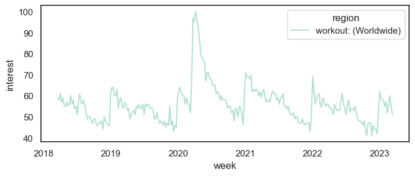
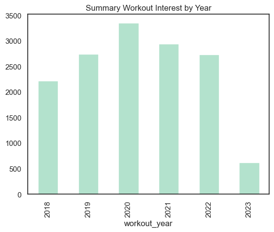
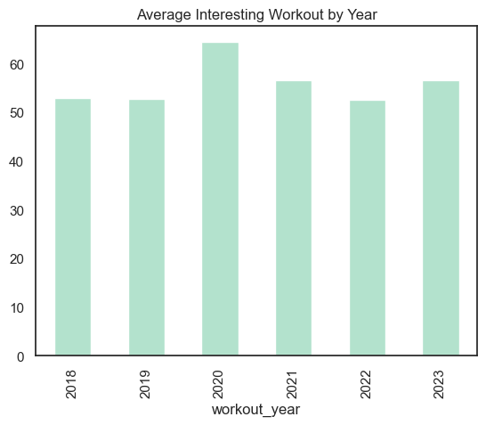
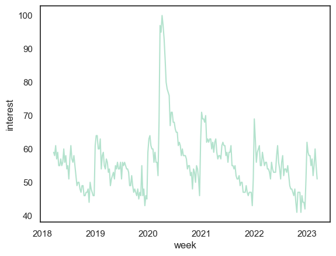
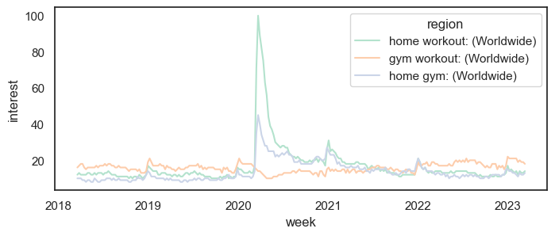
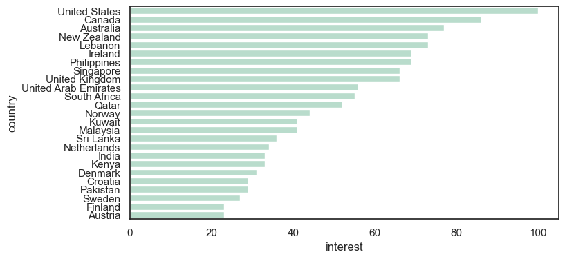
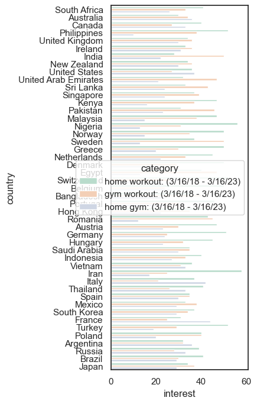
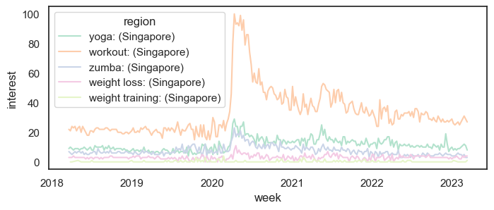
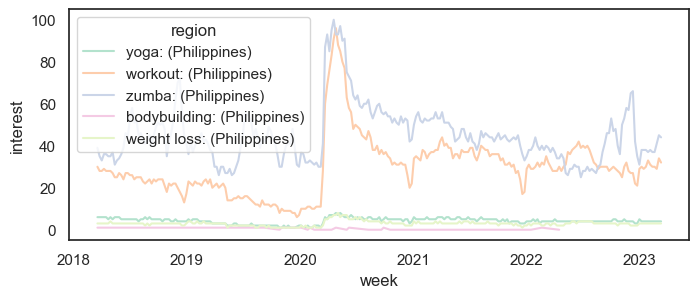

You are a product manager for a fitness studio based in Singapore and are interested in understanding the types of digital products you should offer. You plan to conduct a market analysis in Python to understand how to place your digital fitness products in the regional market. A market analysis will allow you to identify strengths of your competitors, gauge demand, and create unique new digital products and services for potential users.

You are provided with a number of CSV files in the Files-"data" folder, which offer international data on Google Trends and YouTube keyword searches related to fitness and related products. Two helper functions have also been provided, `read_file` and `read_geo`, to help you process and visualize these CSV files for further analysis.

You'll use `pandas` methods to explore this data and drive your product management insights. 

You can continue beyond the bounds of this project and also investigate in-person classes, local gyms, and online personal instructors!


```python
# STARTER CODE - PLEASE DO NOT EDIT ANY CODE IN THIS CELL

import pandas as pd
import seaborn as sns
import matplotlib.pyplot as plt
sns.set(style='white', palette='Pastel2')
import os

def read_file(filepath, plot = True):
    """
    Read a CSV file from a given filepath, convert it into a pandas DataFrame,
    and return a processed DataFrame with three columns: 'week', 'region', and 'interest'. Generate a line plot using Seaborn to visualize the data. This corresponds to the first graphic (time series) returned by trends.google.com. 
    """
    file = pd.read_csv(filepath, header=1)
    df = file.set_index('Week').stack().reset_index()
    df.columns = ['week','region','interest']
    df['week'] = pd.to_datetime(df['week'])
    plt.figure(figsize=(8,3))
    df = df[df['interest']!="<1"]
    df['interest'] = df['interest'].astype(float)

    if plot:
        sns.lineplot(data = df, x= 'week', y= 'interest',hue='region')
    return df

def read_geo(filepath, multi=False):
    """
    Read a CSV file from a given filepath, convert it into a pandas DataFrame,
    and return a processed DataFrame with two columns: 'country' and 'interest'. Generate a bar plot using Seaborn to visualize the data. This corresponds to the second graphic returned by trends.google.com. Use multi=False if only one keyword is being analyzed, and multi=True if more than one keyword is being analyzed.
    """
    file = pd.read_csv(filepath, header=1)

    if not multi:
        file.columns = ['country', 'interest']
        plt.figure(figsize=(8,4))
        sns.barplot(data = file.dropna().iloc[:25,:], y = 'country', x='interest')

    if multi:
        plt.figure(figsize=(3,8))
        file = file.set_index('Country').stack().reset_index()
        file.columns = ['country','category','interest']
        file['interest'] = pd.to_numeric(file['interest'].apply(lambda x: x[:-1]))
        sns.barplot(data=file.dropna(), y = 'country', x='interest', hue='category')

    file = file.sort_values(ascending=False,by='interest')
    return file
```


```python
# Start your coding here ....
# Load data on global interest in workouts
workout = read_file('data/workout.csv')
```


    

    


```python
workout.dtypes
```


    week        datetime64[ns]
    region              object
    interest           float64
    dtype: object


```python
workout.shape
```


    (261, 3)


```python
workout.info
```


    <bound method DataFrame.info of           week                region  interest
    0   2018-03-18  workout: (Worldwide)      59.0
    1   2018-03-25  workout: (Worldwide)      58.0
    2   2018-04-01  workout: (Worldwide)      61.0
    3   2018-04-08  workout: (Worldwide)      57.0
    4   2018-04-15  workout: (Worldwide)      59.0
    ..         ...                   ...       ...
    256 2023-02-12  workout: (Worldwide)      52.0
    257 2023-02-19  workout: (Worldwide)      55.0
    258 2023-02-26  workout: (Worldwide)      60.0
    259 2023-03-05  workout: (Worldwide)      55.0
    260 2023-03-12  workout: (Worldwide)      51.0
    
    [261 rows x 3 columns]>


```python
workout.describe()
```


<div>
<style scoped>
    .dataframe tbody tr th:only-of-type {
        vertical-align: middle;
    }

    .dataframe tbody tr th {
        vertical-align: top;
    }

    .dataframe thead th {
        text-align: right;
    }
</style>
<table border="1" class="dataframe">
  <thead>
    <tr style="text-align: right;">
      <th></th>
      <th>interest</th>
    </tr>
  </thead>
  <tbody>
    <tr>
      <th>count</th>
      <td>261.000000</td>
    </tr>
    <tr>
      <th>mean</th>
      <td>56.007663</td>
    </tr>
    <tr>
      <th>std</th>
      <td>9.050284</td>
    </tr>
    <tr>
      <th>min</th>
      <td>41.000000</td>
    </tr>
    <tr>
      <th>25%</th>
      <td>50.000000</td>
    </tr>
    <tr>
      <th>50%</th>
      <td>55.000000</td>
    </tr>
    <tr>
      <th>75%</th>
      <td>59.000000</td>
    </tr>
    <tr>
      <th>max</th>
      <td>100.000000</td>
    </tr>
  </tbody>
</table>
</div>


```python
workout.groupby('region')['interest'].count()
```


    region
    workout: (Worldwide)    261
    Name: interest, dtype: int64


```python
workout
```


<div>
<style scoped>
    .dataframe tbody tr th:only-of-type {
        vertical-align: middle;
    }

    .dataframe tbody tr th {
        vertical-align: top;
    }

    .dataframe thead th {
        text-align: right;
    }
</style>
<table border="1" class="dataframe">
  <thead>
    <tr style="text-align: right;">
      <th></th>
      <th>week</th>
      <th>region</th>
      <th>interest</th>
    </tr>
  </thead>
  <tbody>
    <tr>
      <th>0</th>
      <td>2018-03-18</td>
      <td>workout: (Worldwide)</td>
      <td>59.0</td>
    </tr>
    <tr>
      <th>1</th>
      <td>2018-03-25</td>
      <td>workout: (Worldwide)</td>
      <td>58.0</td>
    </tr>
    <tr>
      <th>2</th>
      <td>2018-04-01</td>
      <td>workout: (Worldwide)</td>
      <td>61.0</td>
    </tr>
    <tr>
      <th>3</th>
      <td>2018-04-08</td>
      <td>workout: (Worldwide)</td>
      <td>57.0</td>
    </tr>
    <tr>
      <th>4</th>
      <td>2018-04-15</td>
      <td>workout: (Worldwide)</td>
      <td>59.0</td>
    </tr>
    <tr>
      <th>...</th>
      <td>...</td>
      <td>...</td>
      <td>...</td>
    </tr>
    <tr>
      <th>256</th>
      <td>2023-02-12</td>
      <td>workout: (Worldwide)</td>
      <td>52.0</td>
    </tr>
    <tr>
      <th>257</th>
      <td>2023-02-19</td>
      <td>workout: (Worldwide)</td>
      <td>55.0</td>
    </tr>
    <tr>
      <th>258</th>
      <td>2023-02-26</td>
      <td>workout: (Worldwide)</td>
      <td>60.0</td>
    </tr>
    <tr>
      <th>259</th>
      <td>2023-03-05</td>
      <td>workout: (Worldwide)</td>
      <td>55.0</td>
    </tr>
    <tr>
      <th>260</th>
      <td>2023-03-12</td>
      <td>workout: (Worldwide)</td>
      <td>51.0</td>
    </tr>
  </tbody>
</table>
<p>261 rows × 3 columns</p>
</div>


```python
workout.isna().sum()
```


    week        0
    region      0
    interest    0
    dtype: int64


```python
workout['workout_year'] = workout['week'].dt.year
workout['workout_month'] = workout['week'].dt.month
workout['workout_day'] = workout['week'].dt.day
workout.head()
```


<div>
<style scoped>
    .dataframe tbody tr th:only-of-type {
        vertical-align: middle;
    }

    .dataframe tbody tr th {
        vertical-align: top;
    }

    .dataframe thead th {
        text-align: right;
    }
</style>
<table border="1" class="dataframe">
  <thead>
    <tr style="text-align: right;">
      <th></th>
      <th>week</th>
      <th>region</th>
      <th>interest</th>
      <th>workout_year</th>
      <th>workout_month</th>
      <th>workout_day</th>
    </tr>
  </thead>
  <tbody>
    <tr>
      <th>0</th>
      <td>2018-03-18</td>
      <td>workout: (Worldwide)</td>
      <td>59.0</td>
      <td>2018</td>
      <td>3</td>
      <td>18</td>
    </tr>
    <tr>
      <th>1</th>
      <td>2018-03-25</td>
      <td>workout: (Worldwide)</td>
      <td>58.0</td>
      <td>2018</td>
      <td>3</td>
      <td>25</td>
    </tr>
    <tr>
      <th>2</th>
      <td>2018-04-01</td>
      <td>workout: (Worldwide)</td>
      <td>61.0</td>
      <td>2018</td>
      <td>4</td>
      <td>1</td>
    </tr>
    <tr>
      <th>3</th>
      <td>2018-04-08</td>
      <td>workout: (Worldwide)</td>
      <td>57.0</td>
      <td>2018</td>
      <td>4</td>
      <td>8</td>
    </tr>
    <tr>
      <th>4</th>
      <td>2018-04-15</td>
      <td>workout: (Worldwide)</td>
      <td>59.0</td>
      <td>2018</td>
      <td>4</td>
      <td>15</td>
    </tr>
  </tbody>
</table>
</div>


```python
workout_interest_year_sum = workout.groupby('workout_year')['interest'].sum()
workout_interest_year_sum
```


    workout_year
    2018    2220.0
    2019    2745.0
    2020    3351.0
    2021    2944.0
    2022    2736.0
    2023     622.0
    Name: interest, dtype: float64


```python
workout_interest_year_sum.plot(kind='bar', title = 'Summary Workout Interest by Year')
```


    <AxesSubplot: title={'center': 'Summary Workout Interest by Year'}, xlabel='workout_year'>


    

    


```python
workout_interest_year_avg = workout.groupby('workout_year')['interest'].mean()
workout_interest_year_avg
```


    workout_year
    2018    52.857143
    2019    52.788462
    2020    64.442308
    2021    56.615385
    2022    52.615385
    2023    56.545455
    Name: interest, dtype: float64


```python
workout_interest_year_avg.plot(kind='bar', title = 'Average Interesting Workout by Year')
```


    <AxesSubplot: title={'center': 'Average Interesting Workout by Year'}, xlabel='workout_year'>


    

    


```python
workout_pivot = workout.pivot_table(index='workout_month', columns='workout_year', values='interest', aggfunc='mean')
workout_pivot
```


<div>
<style scoped>
    .dataframe tbody tr th:only-of-type {
        vertical-align: middle;
    }

    .dataframe tbody tr th {
        vertical-align: top;
    }

    .dataframe thead th {
        text-align: right;
    }
</style>
<table border="1" class="dataframe">
  <thead>
    <tr style="text-align: right;">
      <th>workout_year</th>
      <th>2018</th>
      <th>2019</th>
      <th>2020</th>
      <th>2021</th>
      <th>2022</th>
      <th>2023</th>
    </tr>
    <tr>
      <th>workout_month</th>
      <th></th>
      <th></th>
      <th></th>
      <th></th>
      <th></th>
      <th></th>
    </tr>
  </thead>
  <tbody>
    <tr>
      <th>1</th>
      <td>NaN</td>
      <td>62.00</td>
      <td>62.00</td>
      <td>69.40</td>
      <td>61.40</td>
      <td>58.4</td>
    </tr>
    <tr>
      <th>2</th>
      <td>NaN</td>
      <td>58.50</td>
      <td>57.75</td>
      <td>62.50</td>
      <td>57.50</td>
      <td>56.0</td>
    </tr>
    <tr>
      <th>3</th>
      <td>58.50</td>
      <td>55.00</td>
      <td>73.60</td>
      <td>61.00</td>
      <td>56.00</td>
      <td>53.0</td>
    </tr>
    <tr>
      <th>4</th>
      <td>57.40</td>
      <td>51.50</td>
      <td>94.25</td>
      <td>60.25</td>
      <td>53.00</td>
      <td>NaN</td>
    </tr>
    <tr>
      <th>5</th>
      <td>57.00</td>
      <td>53.25</td>
      <td>75.60</td>
      <td>59.20</td>
      <td>53.80</td>
      <td>NaN</td>
    </tr>
    <tr>
      <th>6</th>
      <td>55.75</td>
      <td>54.20</td>
      <td>69.50</td>
      <td>59.75</td>
      <td>57.25</td>
      <td>NaN</td>
    </tr>
    <tr>
      <th>7</th>
      <td>56.40</td>
      <td>55.50</td>
      <td>64.25</td>
      <td>58.75</td>
      <td>54.20</td>
      <td>NaN</td>
    </tr>
    <tr>
      <th>8</th>
      <td>53.50</td>
      <td>52.50</td>
      <td>59.80</td>
      <td>54.20</td>
      <td>53.50</td>
      <td>NaN</td>
    </tr>
    <tr>
      <th>9</th>
      <td>48.80</td>
      <td>49.00</td>
      <td>56.75</td>
      <td>50.75</td>
      <td>48.00</td>
      <td>NaN</td>
    </tr>
    <tr>
      <th>10</th>
      <td>47.00</td>
      <td>46.50</td>
      <td>53.75</td>
      <td>48.20</td>
      <td>45.20</td>
      <td>NaN</td>
    </tr>
    <tr>
      <th>11</th>
      <td>47.25</td>
      <td>48.50</td>
      <td>52.00</td>
      <td>47.25</td>
      <td>45.25</td>
      <td>NaN</td>
    </tr>
    <tr>
      <th>12</th>
      <td>49.60</td>
      <td>48.20</td>
      <td>53.25</td>
      <td>47.00</td>
      <td>45.25</td>
      <td>NaN</td>
    </tr>
  </tbody>
</table>
</div>


```python
sns.lineplot(data=workout, x='week', y='interest')
plt.show()
```


    

    


```python
# Assess global interest in fitness
workout_by_month = workout.set_index('week').resample('MS').mean()
month_high = workout_by_month[workout_by_month['interest'] == workout_by_month['interest'].max()]
month_str = str(month_high.index[0].date())
```


```python
workout_by_month
```


<div>
<style scoped>
    .dataframe tbody tr th:only-of-type {
        vertical-align: middle;
    }

    .dataframe tbody tr th {
        vertical-align: top;
    }

    .dataframe thead th {
        text-align: right;
    }
</style>
<table border="1" class="dataframe">
  <thead>
    <tr style="text-align: right;">
      <th></th>
      <th>interest</th>
      <th>workout_year</th>
      <th>workout_month</th>
      <th>workout_day</th>
    </tr>
    <tr>
      <th>week</th>
      <th></th>
      <th></th>
      <th></th>
      <th></th>
    </tr>
  </thead>
  <tbody>
    <tr>
      <th>2018-03-01</th>
      <td>58.50</td>
      <td>2018.0</td>
      <td>3.0</td>
      <td>21.5</td>
    </tr>
    <tr>
      <th>2018-04-01</th>
      <td>57.40</td>
      <td>2018.0</td>
      <td>4.0</td>
      <td>15.0</td>
    </tr>
    <tr>
      <th>2018-05-01</th>
      <td>57.00</td>
      <td>2018.0</td>
      <td>5.0</td>
      <td>16.5</td>
    </tr>
    <tr>
      <th>2018-06-01</th>
      <td>55.75</td>
      <td>2018.0</td>
      <td>6.0</td>
      <td>13.5</td>
    </tr>
    <tr>
      <th>2018-07-01</th>
      <td>56.40</td>
      <td>2018.0</td>
      <td>7.0</td>
      <td>15.0</td>
    </tr>
    <tr>
      <th>...</th>
      <td>...</td>
      <td>...</td>
      <td>...</td>
      <td>...</td>
    </tr>
    <tr>
      <th>2022-11-01</th>
      <td>45.25</td>
      <td>2022.0</td>
      <td>11.0</td>
      <td>16.5</td>
    </tr>
    <tr>
      <th>2022-12-01</th>
      <td>45.25</td>
      <td>2022.0</td>
      <td>12.0</td>
      <td>14.5</td>
    </tr>
    <tr>
      <th>2023-01-01</th>
      <td>58.40</td>
      <td>2023.0</td>
      <td>1.0</td>
      <td>15.0</td>
    </tr>
    <tr>
      <th>2023-02-01</th>
      <td>56.00</td>
      <td>2023.0</td>
      <td>2.0</td>
      <td>15.5</td>
    </tr>
    <tr>
      <th>2023-03-01</th>
      <td>53.00</td>
      <td>2023.0</td>
      <td>3.0</td>
      <td>8.5</td>
    </tr>
  </tbody>
</table>
<p>61 rows × 4 columns</p>
</div>


```python
# Segment global interest by region
three_keywords = read_file('data/three_keywords.csv')
```


    

    


```python
three_keywords.head()
```


<div>
<style scoped>
    .dataframe tbody tr th:only-of-type {
        vertical-align: middle;
    }

    .dataframe tbody tr th {
        vertical-align: top;
    }

    .dataframe thead th {
        text-align: right;
    }
</style>
<table border="1" class="dataframe">
  <thead>
    <tr style="text-align: right;">
      <th></th>
      <th>week</th>
      <th>region</th>
      <th>interest</th>
    </tr>
  </thead>
  <tbody>
    <tr>
      <th>0</th>
      <td>2018-03-18</td>
      <td>home workout: (Worldwide)</td>
      <td>12.0</td>
    </tr>
    <tr>
      <th>1</th>
      <td>2018-03-18</td>
      <td>gym workout: (Worldwide)</td>
      <td>16.0</td>
    </tr>
    <tr>
      <th>2</th>
      <td>2018-03-18</td>
      <td>home gym: (Worldwide)</td>
      <td>10.0</td>
    </tr>
    <tr>
      <th>3</th>
      <td>2018-03-25</td>
      <td>home workout: (Worldwide)</td>
      <td>13.0</td>
    </tr>
    <tr>
      <th>4</th>
      <td>2018-03-25</td>
      <td>gym workout: (Worldwide)</td>
      <td>17.0</td>
    </tr>
  </tbody>
</table>
</div>


```python
three_keywords['workout_year'] = three_keywords['week'].dt.year
three_keywords
```


<div>
<style scoped>
    .dataframe tbody tr th:only-of-type {
        vertical-align: middle;
    }

    .dataframe tbody tr th {
        vertical-align: top;
    }

    .dataframe thead th {
        text-align: right;
    }
</style>
<table border="1" class="dataframe">
  <thead>
    <tr style="text-align: right;">
      <th></th>
      <th>week</th>
      <th>region</th>
      <th>interest</th>
      <th>workout_year</th>
    </tr>
  </thead>
  <tbody>
    <tr>
      <th>0</th>
      <td>2018-03-18</td>
      <td>home workout: (Worldwide)</td>
      <td>12.0</td>
      <td>2018</td>
    </tr>
    <tr>
      <th>1</th>
      <td>2018-03-18</td>
      <td>gym workout: (Worldwide)</td>
      <td>16.0</td>
      <td>2018</td>
    </tr>
    <tr>
      <th>2</th>
      <td>2018-03-18</td>
      <td>home gym: (Worldwide)</td>
      <td>10.0</td>
      <td>2018</td>
    </tr>
    <tr>
      <th>3</th>
      <td>2018-03-25</td>
      <td>home workout: (Worldwide)</td>
      <td>13.0</td>
      <td>2018</td>
    </tr>
    <tr>
      <th>4</th>
      <td>2018-03-25</td>
      <td>gym workout: (Worldwide)</td>
      <td>17.0</td>
      <td>2018</td>
    </tr>
    <tr>
      <th>...</th>
      <td>...</td>
      <td>...</td>
      <td>...</td>
      <td>...</td>
    </tr>
    <tr>
      <th>778</th>
      <td>2023-03-05</td>
      <td>gym workout: (Worldwide)</td>
      <td>19.0</td>
      <td>2023</td>
    </tr>
    <tr>
      <th>779</th>
      <td>2023-03-05</td>
      <td>home gym: (Worldwide)</td>
      <td>12.0</td>
      <td>2023</td>
    </tr>
    <tr>
      <th>780</th>
      <td>2023-03-12</td>
      <td>home workout: (Worldwide)</td>
      <td>14.0</td>
      <td>2023</td>
    </tr>
    <tr>
      <th>781</th>
      <td>2023-03-12</td>
      <td>gym workout: (Worldwide)</td>
      <td>18.0</td>
      <td>2023</td>
    </tr>
    <tr>
      <th>782</th>
      <td>2023-03-12</td>
      <td>home gym: (Worldwide)</td>
      <td>13.0</td>
      <td>2023</td>
    </tr>
  </tbody>
</table>
<p>783 rows × 4 columns</p>
</div>


```python
three_keywords.dtypes
```


    week            datetime64[ns]
    region                  object
    interest               float64
    workout_year             int64
    dtype: object


```python
three_keywords_pivot = three_keywords.pivot_table(index='region', columns='workout_year', values='interest', aggfunc='sum')
three_keywords_pivot
```


<div>
<style scoped>
    .dataframe tbody tr th:only-of-type {
        vertical-align: middle;
    }

    .dataframe tbody tr th {
        vertical-align: top;
    }

    .dataframe thead th {
        text-align: right;
    }
</style>
<table border="1" class="dataframe">
  <thead>
    <tr style="text-align: right;">
      <th>workout_year</th>
      <th>2018</th>
      <th>2019</th>
      <th>2020</th>
      <th>2021</th>
      <th>2022</th>
      <th>2023</th>
    </tr>
    <tr>
      <th>region</th>
      <th></th>
      <th></th>
      <th></th>
      <th></th>
      <th></th>
      <th></th>
    </tr>
  </thead>
  <tbody>
    <tr>
      <th>gym workout: (Worldwide)</th>
      <td>672.0</td>
      <td>829.0</td>
      <td>716.0</td>
      <td>760.0</td>
      <td>933.0</td>
      <td>222.0</td>
    </tr>
    <tr>
      <th>home gym: (Worldwide)</th>
      <td>393.0</td>
      <td>507.0</td>
      <td>1105.0</td>
      <td>815.0</td>
      <td>639.0</td>
      <td>142.0</td>
    </tr>
    <tr>
      <th>home workout: (Worldwide)</th>
      <td>501.0</td>
      <td>622.0</td>
      <td>1528.0</td>
      <td>861.0</td>
      <td>684.0</td>
      <td>153.0</td>
    </tr>
  </tbody>
</table>
</div>


```python
three_keywords['region'].value_counts(normalize=True)
```


    home workout: (Worldwide)    0.333333
    gym workout: (Worldwide)     0.333333
    home gym: (Worldwide)        0.333333
    Name: region, dtype: float64


```python
# current that is equal to one of three values: "home workout," "gym workout," or "home gym," depending on which query generated the most interest from 2022 to 2023.
current = 'gym workout'
```


```python
# Create a second variable, called peak_covid, equal to one of the same three values, but indicating which query was generating the most interest during peak-COVID lockdowns in 2020.
peak_covid = 'home workout'
```


```python
# Assessing regional demand
workout_global = read_geo('data/workout_global.csv')
```


    

    


```python
workout_global.head()
```


<div>
<style scoped>
    .dataframe tbody tr th:only-of-type {
        vertical-align: middle;
    }

    .dataframe tbody tr th {
        vertical-align: top;
    }

    .dataframe thead th {
        text-align: right;
    }
</style>
<table border="1" class="dataframe">
  <thead>
    <tr style="text-align: right;">
      <th></th>
      <th>country</th>
      <th>interest</th>
    </tr>
  </thead>
  <tbody>
    <tr>
      <th>5</th>
      <td>United States</td>
      <td>100.0</td>
    </tr>
    <tr>
      <th>12</th>
      <td>Canada</td>
      <td>86.0</td>
    </tr>
    <tr>
      <th>18</th>
      <td>Australia</td>
      <td>77.0</td>
    </tr>
    <tr>
      <th>22</th>
      <td>New Zealand</td>
      <td>73.0</td>
    </tr>
    <tr>
      <th>23</th>
      <td>Lebanon</td>
      <td>73.0</td>
    </tr>
  </tbody>
</table>
</div>


```python
# Created a DataFrame of top_25_countries
top_country = workout_global.head(25)
top_country
```


<div>
<style scoped>
    .dataframe tbody tr th:only-of-type {
        vertical-align: middle;
    }

    .dataframe tbody tr th {
        vertical-align: top;
    }

    .dataframe thead th {
        text-align: right;
    }
</style>
<table border="1" class="dataframe">
  <thead>
    <tr style="text-align: right;">
      <th></th>
      <th>country</th>
      <th>interest</th>
    </tr>
  </thead>
  <tbody>
    <tr>
      <th>5</th>
      <td>United States</td>
      <td>100.0</td>
    </tr>
    <tr>
      <th>12</th>
      <td>Canada</td>
      <td>86.0</td>
    </tr>
    <tr>
      <th>18</th>
      <td>Australia</td>
      <td>77.0</td>
    </tr>
    <tr>
      <th>22</th>
      <td>New Zealand</td>
      <td>73.0</td>
    </tr>
    <tr>
      <th>23</th>
      <td>Lebanon</td>
      <td>73.0</td>
    </tr>
    <tr>
      <th>30</th>
      <td>Ireland</td>
      <td>69.0</td>
    </tr>
    <tr>
      <th>31</th>
      <td>Philippines</td>
      <td>69.0</td>
    </tr>
    <tr>
      <th>35</th>
      <td>Singapore</td>
      <td>66.0</td>
    </tr>
    <tr>
      <th>36</th>
      <td>United Kingdom</td>
      <td>66.0</td>
    </tr>
    <tr>
      <th>47</th>
      <td>United Arab Emirates</td>
      <td>56.0</td>
    </tr>
    <tr>
      <th>50</th>
      <td>South Africa</td>
      <td>55.0</td>
    </tr>
    <tr>
      <th>53</th>
      <td>Qatar</td>
      <td>52.0</td>
    </tr>
    <tr>
      <th>68</th>
      <td>Norway</td>
      <td>44.0</td>
    </tr>
    <tr>
      <th>70</th>
      <td>Kuwait</td>
      <td>41.0</td>
    </tr>
    <tr>
      <th>72</th>
      <td>Malaysia</td>
      <td>41.0</td>
    </tr>
    <tr>
      <th>79</th>
      <td>Sri Lanka</td>
      <td>36.0</td>
    </tr>
    <tr>
      <th>80</th>
      <td>Netherlands</td>
      <td>34.0</td>
    </tr>
    <tr>
      <th>83</th>
      <td>India</td>
      <td>33.0</td>
    </tr>
    <tr>
      <th>84</th>
      <td>Kenya</td>
      <td>33.0</td>
    </tr>
    <tr>
      <th>87</th>
      <td>Denmark</td>
      <td>31.0</td>
    </tr>
    <tr>
      <th>90</th>
      <td>Croatia</td>
      <td>29.0</td>
    </tr>
    <tr>
      <th>91</th>
      <td>Pakistan</td>
      <td>29.0</td>
    </tr>
    <tr>
      <th>92</th>
      <td>Sweden</td>
      <td>27.0</td>
    </tr>
    <tr>
      <th>102</th>
      <td>Finland</td>
      <td>23.0</td>
    </tr>
    <tr>
      <th>103</th>
      <td>Austria</td>
      <td>23.0</td>
    </tr>
  </tbody>
</table>
</div>


```python
# Created a variable top_workout with a string value for the name of the country with the highest interest in workouts.
top_workout = top_country['country'].iloc[0]
top_workout
```


    'United States'


```python
# Assessing regional demand for home workouts, gym workouts, and home gyms
geo_categories = read_geo('data/geo_three_keywords.csv', multi=True)
```


    

    


```python
geo_categories.head()
```


<div>
<style scoped>
    .dataframe tbody tr th:only-of-type {
        vertical-align: middle;
    }

    .dataframe tbody tr th {
        vertical-align: top;
    }

    .dataframe thead th {
        text-align: right;
    }
</style>
<table border="1" class="dataframe">
  <thead>
    <tr style="text-align: right;">
      <th></th>
      <th>country</th>
      <th>category</th>
      <th>interest</th>
    </tr>
  </thead>
  <tbody>
    <tr>
      <th>102</th>
      <td>Iran</td>
      <td>home workout: (3/16/18 - 3/16/23)</td>
      <td>58</td>
    </tr>
    <tr>
      <th>45</th>
      <td>Nigeria</td>
      <td>home workout: (3/16/18 - 3/16/23)</td>
      <td>56</td>
    </tr>
    <tr>
      <th>9</th>
      <td>Philippines</td>
      <td>home workout: (3/16/18 - 3/16/23)</td>
      <td>52</td>
    </tr>
    <tr>
      <th>66</th>
      <td>Switzerland</td>
      <td>home workout: (3/16/18 - 3/16/23)</td>
      <td>52</td>
    </tr>
    <tr>
      <th>123</th>
      <td>Turkey</td>
      <td>home workout: (3/16/18 - 3/16/23)</td>
      <td>52</td>
    </tr>
  </tbody>
</table>
</div>


```python
MESA_countries = ['Philippines','Singapore','United Arab Emirates','Qatar','Kuwait','Lebanon','Malaysia','Sri Lanka','India','Pakistan']
MESA = geo_categories.loc[geo_categories.country.isin(MESA_countries), :]
```


```python
MESA
```


<div>
<style scoped>
    .dataframe tbody tr th:only-of-type {
        vertical-align: middle;
    }

    .dataframe tbody tr th {
        vertical-align: top;
    }

    .dataframe thead th {
        text-align: right;
    }
</style>
<table border="1" class="dataframe">
  <thead>
    <tr style="text-align: right;">
      <th></th>
      <th>country</th>
      <th>category</th>
      <th>interest</th>
    </tr>
  </thead>
  <tbody>
    <tr>
      <th>9</th>
      <td>Philippines</td>
      <td>home workout: (3/16/18 - 3/16/23)</td>
      <td>52</td>
    </tr>
    <tr>
      <th>19</th>
      <td>India</td>
      <td>gym workout: (3/16/18 - 3/16/23)</td>
      <td>50</td>
    </tr>
    <tr>
      <th>42</th>
      <td>Malaysia</td>
      <td>home workout: (3/16/18 - 3/16/23)</td>
      <td>47</td>
    </tr>
    <tr>
      <th>28</th>
      <td>United Arab Emirates</td>
      <td>gym workout: (3/16/18 - 3/16/23)</td>
      <td>47</td>
    </tr>
    <tr>
      <th>40</th>
      <td>Pakistan</td>
      <td>gym workout: (3/16/18 - 3/16/23)</td>
      <td>46</td>
    </tr>
    <tr>
      <th>31</th>
      <td>Sri Lanka</td>
      <td>gym workout: (3/16/18 - 3/16/23)</td>
      <td>43</td>
    </tr>
    <tr>
      <th>34</th>
      <td>Singapore</td>
      <td>gym workout: (3/16/18 - 3/16/23)</td>
      <td>39</td>
    </tr>
    <tr>
      <th>10</th>
      <td>Philippines</td>
      <td>gym workout: (3/16/18 - 3/16/23)</td>
      <td>38</td>
    </tr>
    <tr>
      <th>43</th>
      <td>Malaysia</td>
      <td>gym workout: (3/16/18 - 3/16/23)</td>
      <td>38</td>
    </tr>
    <tr>
      <th>33</th>
      <td>Singapore</td>
      <td>home workout: (3/16/18 - 3/16/23)</td>
      <td>37</td>
    </tr>
    <tr>
      <th>30</th>
      <td>Sri Lanka</td>
      <td>home workout: (3/16/18 - 3/16/23)</td>
      <td>33</td>
    </tr>
    <tr>
      <th>27</th>
      <td>United Arab Emirates</td>
      <td>home workout: (3/16/18 - 3/16/23)</td>
      <td>32</td>
    </tr>
    <tr>
      <th>39</th>
      <td>Pakistan</td>
      <td>home workout: (3/16/18 - 3/16/23)</td>
      <td>31</td>
    </tr>
    <tr>
      <th>18</th>
      <td>India</td>
      <td>home workout: (3/16/18 - 3/16/23)</td>
      <td>28</td>
    </tr>
    <tr>
      <th>32</th>
      <td>Sri Lanka</td>
      <td>home gym: (3/16/18 - 3/16/23)</td>
      <td>24</td>
    </tr>
    <tr>
      <th>35</th>
      <td>Singapore</td>
      <td>home gym: (3/16/18 - 3/16/23)</td>
      <td>24</td>
    </tr>
    <tr>
      <th>41</th>
      <td>Pakistan</td>
      <td>home gym: (3/16/18 - 3/16/23)</td>
      <td>23</td>
    </tr>
    <tr>
      <th>20</th>
      <td>India</td>
      <td>home gym: (3/16/18 - 3/16/23)</td>
      <td>22</td>
    </tr>
    <tr>
      <th>29</th>
      <td>United Arab Emirates</td>
      <td>home gym: (3/16/18 - 3/16/23)</td>
      <td>21</td>
    </tr>
    <tr>
      <th>44</th>
      <td>Malaysia</td>
      <td>home gym: (3/16/18 - 3/16/23)</td>
      <td>15</td>
    </tr>
    <tr>
      <th>11</th>
      <td>Philippines</td>
      <td>home gym: (3/16/18 - 3/16/23)</td>
      <td>10</td>
    </tr>
  </tbody>
</table>
</div>


```python
# Assess the split of interest by country and category
# Setting index and unstacking on a DataFrame
MESA.set_index(['country','category']).unstack()
```


<div>
<style scoped>
    .dataframe tbody tr th:only-of-type {
        vertical-align: middle;
    }

    .dataframe tbody tr th {
        vertical-align: top;
    }

    .dataframe thead tr th {
        text-align: left;
    }

    .dataframe thead tr:last-of-type th {
        text-align: right;
    }
</style>
<table border="1" class="dataframe">
  <thead>
    <tr>
      <th></th>
      <th colspan="3" halign="left">interest</th>
    </tr>
    <tr>
      <th>category</th>
      <th>gym workout: (3/16/18 - 3/16/23)</th>
      <th>home gym: (3/16/18 - 3/16/23)</th>
      <th>home workout: (3/16/18 - 3/16/23)</th>
    </tr>
    <tr>
      <th>country</th>
      <th></th>
      <th></th>
      <th></th>
    </tr>
  </thead>
  <tbody>
    <tr>
      <th>India</th>
      <td>50</td>
      <td>22</td>
      <td>28</td>
    </tr>
    <tr>
      <th>Malaysia</th>
      <td>38</td>
      <td>15</td>
      <td>47</td>
    </tr>
    <tr>
      <th>Pakistan</th>
      <td>46</td>
      <td>23</td>
      <td>31</td>
    </tr>
    <tr>
      <th>Philippines</th>
      <td>38</td>
      <td>10</td>
      <td>52</td>
    </tr>
    <tr>
      <th>Singapore</th>
      <td>39</td>
      <td>24</td>
      <td>37</td>
    </tr>
    <tr>
      <th>Sri Lanka</th>
      <td>43</td>
      <td>24</td>
      <td>33</td>
    </tr>
    <tr>
      <th>United Arab Emirates</th>
      <td>47</td>
      <td>21</td>
      <td>32</td>
    </tr>
  </tbody>
</table>
</div>


```python
top_home_workout_country = 'Philippines'
```


```python
# A deeper dive into two countries
sng = read_file('data/yoga_zumba_sng.csv')
```


    

    


```python
phl = read_file('data/yoga_zumba_phl.csv')
```


    

    


```python
# Create a list, pilot_content, which contains the top two media types (not including workout), that you see in the plots are worth piloting in digital form in these countries.
pilot_content = ['zumba', 'yoga']
```

